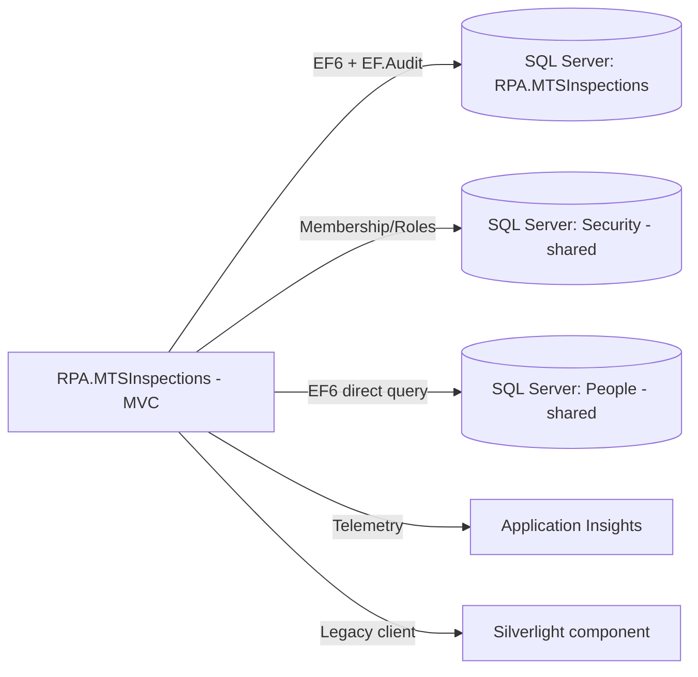

# Assessment - RPA.MTSInspections

## Identification

**Repository Name**: rpa-mts-inspections (solution: `RPA.MTSInspections`)
**Type**: Web Application (ASP.NET MVC 5, with Silverlight (`SL`) legacy artifacts)
**Language**: C#
**Frameworks**: .NET Framework 4.5.2, ASP.NET MVC 5.2.4, Entity Framework 6.2.0 (+ `EF.Audit` change-auditing), ASP.NET SQL Membership/Role Provider, classic Application Insights SDK 2.5.1, DocumentFormat.OpenXml, EPPlus 4.5.1
**Repository URL**: Local clone only — `rpa-mts-inspections/`

## Summary
RPA.MTSInspections ("MTS" — likely "Manure/Materials Tracking System" or a plant/scheme inspections system; controller names `PlantController` and `SchemeController` suggest agricultural equipment/scheme inspections) is a mid-sized ASP.NET MVC portal with five controllers: `Admin`, `Export`, `Home`, `Plant`, `Scheme`. It includes a legacy `SL` (Silverlight) folder, indicating the application once had (or still has) a Silverlight component — Silverlight is fully end-of-life and unsupported in modern browsers, so this is a significant modernization/removal candidate.

The app uses `EF.Audit`, a NuGet package that adds change-auditing to Entity Framework contexts — meaning the app has a compliance/audit-trail requirement on its data that must be preserved in any modernized data-access layer. It also instruments itself with the classic Application Insights SDK and `Microsoft.AspNet.TelemetryCorrelation`, and shares the estate-wide "Security" and "People" SQL Server databases exactly like `rpa-inspections-workbench`.

## Service Dependencies

### Cloud Services (GCP/AWS/Azure)
- **Application Insights (classic SDK 2.5.1)**: telemetry/APM, same pattern as `bank-holidays`

### Databases
- **MTSInspectionsContext** (`RPA.MTSInspections`, local SQL Server `Data Source=.`): primary EF6 application database, with `EF.Audit` change tracking enabled
- **IDTSecurityConnection** (`Security` DB on `D3VMPRWSQL003`): shared authentication/authorization database
- **PeopleContext** (`People` DB on `D3VMPRWSQL003`): direct SQL Server access to the shared "People" data domain (same pattern as `rpa-inspections-workbench`)

### Messaging
- None found

### Storage
- **Local `Uploads/` directory**: file uploads stored on local disk
- **`SCC-Seed-Data.sql`**: a checked-in SQL seed-data script at the repo root — implies a manual/scripted data-seeding step in deployment, not managed via EF Migrations alone
- **`pii-review-session.json`**: a checked-in file at the repo root whose name strongly suggests a **PII (personally identifiable information) review artifact** — this should be treated as sensitive and reviewed/excluded before any repository is shared further or used for training/analysis; flag for the data-protection/compliance owner

### APIs and External Integrations
- None found (no HTTP client dependencies observed)

### Other Dependencies
- **IDT.Web.Security** (`IDT.dll`, under `Assemblies/`) — same shared internal library as the other three legacy portal apps
- **Silverlight (`SL/` folder)**: legacy client-side technology, unsupported by all modern browsers — must be replaced with a JavaScript/Blazor/React equivalent if the functionality it provides is still in active use

## Communication

### Exposed Endpoints
| Method | Path | Description | Authentication |
|--------|------|--------------|-----------------|
| — | `/Admin/*` | Application administration | Membership/Roles |
| — | `/Export/*` | Data export (likely Excel/OpenXML-based, given EPPlus/DocumentFormat.OpenXml deps) | Membership/Roles |
| — | `/Home/*` | Landing pages | Membership/Roles |
| — | `/Plant/*` | Plant/equipment inspection records | Membership/Roles |
| — | `/Scheme/*` | Scheme-related inspection records | Membership/Roles |

### Consumed Endpoints
- None found

### Asynchronous Communication
- None found

### Communication Diagram

## Configuration

### Environment Variables
- None — `Web.{Debug,Release,SIT,UAT,TEST,Production}.config` transforms (this app has an extra "TEST" environment transform not seen in siblings)

### Configuration Files
- `Web.config` (+ per-environment transforms): connection strings, Membership/Profile/RoleManager, Application Insights module registration
- `ApplicationInsights.config`: classic AI SDK configuration file
- `packages.config`: legacy NuGet dependency pinning

### Secrets and Sensitive Parameters
- SQL connections use Windows Integrated Security — no stored credentials in source
- `pii-review-session.json` — **treat as sensitive**; confirm its contents and provenance before further processing or distribution

## Infrastructure

### Containerization
- **Dockerfile**: No

### Kubernetes/Helm
- **Manifests**: No

### Infrastructure as Code
- **Terraform/Bicep**: No

### CI/CD
- **Pipeline**: None found specific to this app (only the generic scaffolded workflow files injected by the migration tooling)

## Testing

### Coverage
- Not measured

### Test Types
- **Unit**: Yes — `RPA.MTSInspections.Tests` (NUnit 3.10.1, Moq, EntityFrameworkTesting.Moq)
- **Integration/E2E**: Not evident

### Observations
Test tooling consistent with the rest of the legacy portal estate.

## Points of Attention for Multi-Cloud/Azure Migration

### Cloud-Specific Dependencies
- None (on-prem), but shares "Security" and "People" SQL Server dependencies with the rest of the legacy estate

### Hardcoded Configurations
- Hardcoded SQL Server hostnames (`D3VMPRWSQL003`) — must be parameterized
- `\\`-style local upload paths — must move to Blob Storage

### Legacy Code or Old Patterns
- **Silverlight component (`SL/` folder)** — highest-priority legacy-technology risk in this app; Silverlight cannot run in any current browser, so this functionality is either already dead/unused (candidate for removal) or already replaced by something not in this repo (needs owner confirmation)
- `EF.Audit`-based change auditing — must be re-implemented via EF Core interceptors/`SaveChanges` overrides or a temporal-tables approach on Azure SQL Database to preserve the audit trail
- Classic Application Insights SDK — migrate to `Microsoft.ApplicationInsights.AspNetCore`/OpenTelemetry
- Shared `IDT.Web.Security`/"Security" database dependency — same portfolio-level risk as other legacy apps
- Direct SQL access to "People" database instead of using `people-api`

### Specific Recommendations
1. **Immediately confirm the purpose and sensitivity of `pii-review-session.json`** with the data owner before any further copying/processing of this repository, and ensure it is excluded from any generated build artifacts or shared reports.
2. Determine whether the Silverlight (`SL/`) functionality is still in active use; if so, scope a dedicated UI-rewrite workstream (e.g., to Blazor or a JS framework) as it cannot be "lifted and shifted."
3. Re-implement `EF.Audit` auditing using EF Core `SaveChanges` interceptors, temporal tables, or Azure SQL Database auditing features to preserve compliance behavior.
4. Replace direct `PeopleContext` SQL access with calls to `people-api`.
5. Migrate `SCC-Seed-Data.sql` into a proper EF Core migration/seed strategy rather than a standalone script.
6. Coordinate the shared "Security" database / `IDT.dll` migration with the other three dependent apps.

## Additional Observations
- Of the four legacy MVC portal apps, this one carries the most modernization risk due to the Silverlight dependency and the presence of a PII-flagged file that needs data-governance review before the migration proceeds further.
